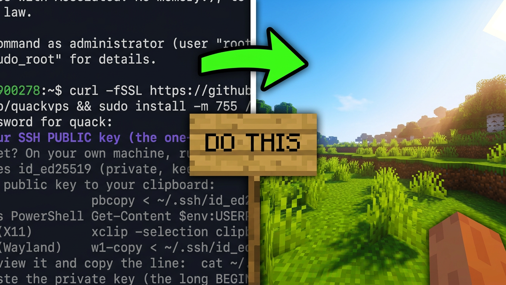

# quackvps

[](https://github.com/rvhoyos/quackvps/releases/latest)
[](https://github.com/rvhoyos/quackvps/releases)
[](https://github.com/rvhoyos/quackvps/actions/workflows/ci.yml)
[](LICENSE)
[](https://buymeacoffee.com/monte.carlo.sim)

Set up a modded Minecraft server and its web layer (panel, live map, HTTPS, firewall) on a fresh Ubuntu/Debian VPS.

**Video tutorial** (click to watch on YouTube):

[](https://www.youtube.com/watch?v=kWWR3b8d7yw)

SSH into your VPS and paste:

```sh
curl -fsSL https://github.com/rvhoyos/quackvps/releases/latest/download/quackvps-linux-$(dpkg --print-architecture) -o /tmp/quackvps && sudo install -m 755 /tmp/quackvps /usr/local/bin/quackvps && sudo quackvps
```

This installs quackvps to `/usr/local/bin`, so afterwards it's just `sudo quackvps`. To uninstall: `sudo rm /usr/local/bin/quackvps`.

Answer the prompts, or press Enter through to accept the defaults.

<details>
<summary>First time on a fresh VPS? Start here</summary>

A new VPS logs you in as `root` with the password your host gave you:

```sh
ssh root@YOUR_VPS_IP
```

quackvps runs the server as a normal user, not root, so create one (it also
needs `sudo`):

```sh
adduser YOURNAME
usermod -aG sudo YOURNAME
```

Log back in as that user, then paste the install command above:

```sh
ssh YOURNAME@YOUR_VPS_IP
```

If you later reinstall the OS, SSH will refuse with `REMOTE HOST IDENTIFICATION
HAS CHANGED` because the server's key is new. Clear the old one and reconnect:

```sh
ssh-keygen -R YOUR_VPS_IP
```

On Windows, run the same `ssh` and `ssh-keygen` commands from PowerShell; the
OpenSSH client ships with Windows 10 (1809+) and 11.
</details>

## What it does

- Installs the server (Fabric, NeoForge, Forge, Quilt, or Vanilla) with the matching Java, side by side, without touching your system Java.
- Runs it as a `systemd` service inside `screen`: restarts on crash, starts on boot, attach a console with `screen -r <name>`.
- Installs mods and modpacks from Modrinth, filtered live to ones that run on your loader and version.
- Adds mods to a server you already have: pick it, name the mods, and they land in `mods/` with their dependencies while the server is stopped. The version comes from the server's own world data, so the builds match what it runs.
- Sets up the optional web layer, picked on one screen:
  - **QuackedSMP** management panel (plus Votifier v2).
  - **BlueMap** live world map.
  - **Simple Voice Chat** proximity voice.
  - **Bedrock crossplay** (Geyser + Floodgate), so phone and console players can join. Fabric and NeoForge only.
- Configures Caddy as a reverse proxy. With a domain, each web service gets a subdomain with automatic HTTPS. Without one, services stay on localhost and you get a copy-paste `ssh -L` tunnel command.
- Configures UFW, opening only the ports that must be public and keeping your SSH port open.
- Optionally hardens SSH to key-only (opt-in, runs first): walks you through a key and verifies it works before turning off password login.
- Removes a server: its service, ports, web address and folder, and nothing belonging to the other servers on the box.

Run `sudo quackvps` again to add another server. Each one gets its own folder, service, ports, and subdomains, and coexists with the rest. Ports are scanned every run and the next free one is the default.

Works on a fresh VPS or one already running servers. New installs go in their own folder, service, and ports without touching what's already there, and updating, restoring, and adding mods work on any existing server, including ones this tool didn't create: the loader is read from the launch files on disk, the Minecraft version from `level.dat`, and existing mods are identified by hashing the jars, not from records this tool keeps.

Updating or restoring a server set up by hand keeps its existing heap flags, read in gigabytes (`-Xms2G`, `-Xmx6G`). Write them that way rather than in megabytes (`-Xmx8192M`), which falls back to the default 1G/4G.

## Requirements

- An Ubuntu/Debian-family VPS, any release. Needs `apt`, `systemd`, and `ufw`.
- Run it with `sudo`. The server itself runs as your login user, never as root.

## Modpacks

The wizard offers a curated set per loader, live-filtered to the ones that actually build for your chosen loader and Minecraft version. In headless mode, `--modpack` takes **any Modrinth modpack slug**, so you're not limited to these. A slug is the last path segment of a Modrinth project URL, e.g. `modrinth.com/modpack/`**`cobblemon-fabric`**.

Modrinth's "works on servers" tag is author-set and often wrong, so a scheduled job boots one pack a day. A pack that crashes is parked for the version that broke it: it stops being offered, and `--modpack` fails up front instead of leaving you a server that won't start.

The curated picks:

<details>
<summary>NeoForge (1.21+)</summary>

`quackedsmppack` `the-pixelmon-modpack` `create_plus` `cobblemon-neoforge` `cobblemon-x-creating` `better-mc-neoforge-bmc5` `blockfront-mod-pack` `farming-experience` `keralis-create-pack` `create-complete-by-shalz` `create.ultimate` `create-oneblock` `battlearmorytacz` `reminiscent-create` `old-school-minecraft` `terrafirmacraftmodpack`
</details>

<details>
<summary>Forge (1.20.x)</summary>

`the-pixelmon-modpack` `create-live-5` `better-mc-forge-bmc4` `create_plus` `the-lost-era` `medieval-mc-forge-mmc4` `dwellers-modpack` `prehistoric-world-modpack` `parasites-reloaded` `cave-horror-project-modpack` `alaskan-wilderness` `mc-rebalanced` `technical-electrical` `reminiscence` `osmp` `slimes-adventure`
</details>

<details>
<summary>Fabric / Quilt</summary>

`cobblemon-fabric` `cobbleverse` `aged` `prominence-2-fabric` `better-mc-fabric-bmc2` `homestead` `harpy-express` `realisticcraft` `landscapes-reimagined-genesis` `sensible-modpack` `ardacraft` `elysium-days` `better-adventures++` `jonathans-cobblemon-pack`
</details>

## Flags

Run with no flags for the wizard. These apply to the interactive run:

| Flag | Does |
|---|---|
| `--dir <path>` | Start the folder picker at a given parent directory. |
| `--version` | Print the version and exit. |
| `--help` | Print usage and exit. |

## Headless (scripts & CI)

Pass `--mode` to run without prompts. A missing or invalid flag exits non-zero instead of prompting. Versions and mods are validated up front, so a typo fails before anything is installed.

```sh
# Install a NeoForge server with a live map and voice chat, no domain (localhost + ssh -L).
sudo quackvps --mode install --parent /home/ubuntu/mc --instance survival \
  --loader neoforge --mcversion 1.21.8 --server-port 25565 --heap-min 2 --heap-max 4 \
  --bluemap --bluemap-port 8100 --voicechat --voicechat-port 24454

# Update that server to a newer Minecraft version (keeps your world and mods).
sudo quackvps --mode update --parent /home/ubuntu/mc --instance survival --mcversion 26.1.2

# Restore a world backup from the server's backups/ folder.
sudo quackvps --mode restore --parent /home/ubuntu/mc --instance survival \
  --backup world-20260610-161024.zip

# Add mods to it, dependencies included. Stops the server, installs, starts it back up.
sudo quackvps --mode add-mods --parent /home/ubuntu/mc --instance survival \
  --mods simple-voice-chat,bluemap

# Take that server off the box, world included. A script has no confirmation to answer, so --yes
# stands in for the ones the wizard asks.
sudo quackvps --mode remove --parent /home/ubuntu/mc --instance survival \
  --remove infra,files --yes
```

Every run needs `--mode`, `--parent`, and `--instance`.

**Install** (`--mode install`):

| Flag | Does |
|---|---|
| `--loader` | `fabric`, `neoforge`, `forge`, `quilt`, or `vanilla`. |
| `--mcversion` | Minecraft version, e.g. `1.21.8`. |
| `--heap-min` / `--heap-max` | JVM heap in GB (`-Xms` / `-Xmx`). |
| `--server-port` | Minecraft game port. |
| `--modpack` | Modpack slug (optional). |
| `--dashboard` / `--votifier` / `--bluemap` / `--voicechat` / `--geyser` | Enable an add-on; each needs its `-port`. `--geyser` is Bedrock crossplay, on Fabric and NeoForge only. |
| `--dashboard-port` / `--votifier-port` / `--bluemap-port` / `--voicechat-port` / `--geyser-port` | Port for the matching add-on. |
| `--domain` / `--email` | Serve web add-ons at `<sub>.<domain>` over HTTPS instead of localhost. |
| `--dashboard-subdomain` / `--bluemap-subdomain` | Subdomain per web add-on (with `--domain`). |
| `--harden-ssh` / `--ssh-pubkey` | Harden SSH to key-only. `--ssh-pubkey` is required with it. |

**Update** (`--mode update`):

| Flag | Does |
|---|---|
| `--mcversion` | Target Minecraft version. The loader is detected from disk, not passed. |
| `--empty-mods` | Start fresh with an empty `mods/` instead of upgrading the existing mods. |

**Restore** (`--mode restore`):

| Flag | Does |
|---|---|
| `--backup` | Backup zip to restore, by filename or full path, from the server's `backups/` folder. |

**Add mods** (`--mode add-mods`):

| Flag | Does |
|---|---|
| `--mods` | Modrinth slugs to install, comma separated. Required dependencies are pulled in too. |
| `--mcversion` | Only for a server that has never generated a world. Otherwise the version is read from `level.dat`, and a mismatch with `--mcversion` stops the run before anything is downloaded. |

Mods already installed are left alone. If the server won't start with the new jars, they are removed and it is started again, and the reason from its log is printed.

**Remove** (`--mode remove`):

| Flag | Does |
|---|---|
| `--remove` | What to take away: `infra` (its service, firewall ports and web address), `files` (its folder, world included), or both, comma separated. |
| `--yes` | Go ahead. Required, since a script has no confirmation to answer. |
| `--remove-unit-file` | Also delete a service file this tool didn't write. Without it, such a service is stopped and disabled but left on disk. |

Neither `--remove` nor `--yes` has a default: deleting a world is not something a missing flag should decide. Backups in `backups/` go with the folder, so copy off what you want to keep first.

`--unit <service>` applies to update, restore, add-mods and remove: the service that manages the server, when it isn't `mc-<instance>.service`.

## Build from source

```sh
go build -o quackvps ./cmd/quackvps
```

Releases target `linux/amd64` and `linux/arm64`.

## License

[GPLv3](LICENSE). You may use, run, and modify it freely; if you distribute a modified version, it must also be GPLv3 with source available.
